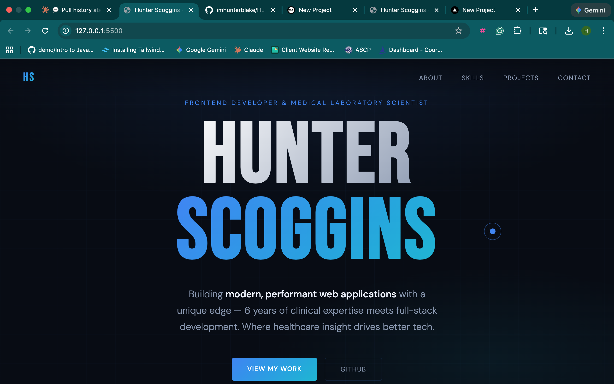

# Hunter Scoggins Portfolio

Professional portfolio website for **Hunter Scoggins**, a Frontend Developer and Medical Laboratory Scientist, built to showcase technical projects, clinical domain expertise, and modern UI/UX execution.

## Live Website

- Repository: https://github.com/imhunterblake/Hunter-Scogggins-Portfolio

## Preview



## About This Project

This portfolio is designed to communicate both technical skill and real-world impact.
It combines a clean, high-contrast visual identity with smooth interactions and clear storytelling around projects, experience, and career direction.

### Core Focus

- Present a strong frontend engineering profile
- Highlight healthcare + software crossover experience
- Showcase shipped project work with live and GitHub links
- Provide clear contact pathways for recruiters and hiring teams

## Features

- **Modern hero section** with gradient visual treatment and animated intro
- **Custom cursor system** with dynamic hover scaling
- **Scroll reveal animations** powered by `IntersectionObserver`
- **Parallax effects** on hero background/grid while scrolling
- **Structured sections** for About, Skills, Projects, and Contact
- **Responsive layout** optimized for desktop and mobile viewports
- **Performance-minded vanilla stack** (no heavy frontend framework)

## Tech Stack

- **HTML5** for semantic page structure
- **CSS3** with custom properties, gradients, and responsive layouts
- **JavaScript (ES6+)** for interactive UI behavior and motion
- **Google Fonts** (`Bebas Neue`, `DM Sans`) for typography

## Project Structure

```text
.
├── index.html      # Main page content and section structure
├── styles.css      # Visual system, layout, responsive styling, animations
└── script.js       # Cursor interaction, reveal observer, parallax behavior
```

## Getting Started

### 1) Clone the repository

```bash
git clone https://github.com/imhunterblake/Hunter-Scogggins-Portfolio.git
cd Hunter-Scogggins-Portfolio
```

### 2) Run locally

Because this is a static site, you can run it with any local server.

**Option A (VS Code Live Server extension):**
- Open project in VS Code
- Right-click `index.html`
- Click **Open with Live Server**

**Option B (Python):**

```bash
python3 -m http.server 5500
```

Then open `http://localhost:5500`.

## Deployment

This portfolio is static and deploys easily to:

- Vercel
- Netlify
- GitHub Pages

For Vercel:
1. Import the GitHub repository
2. Framework preset: **Other**
3. Build command: _(none)_
4. Output directory: project root (`/`)

## Customization Guide

- Update personal content in `index.html` (bio, projects, links, contact)
- Adjust theme colors in CSS variables under `:root` in `styles.css`
- Tune interaction behavior (cursor speed, reveal threshold, parallax intensity) in `script.js`

## Accessibility & UX Notes

- Semantic sectioning improves document structure
- Smooth scrolling and reveal effects are balanced for readability
- Clear typography hierarchy supports quick scanning by recruiters

## Roadmap

- Add dedicated project detail pages
- Add downloadable resume button
- Add form-based contact with validation + email service
- Add Lighthouse performance/accessibility score badge

## Author

**Hunter Scoggins**

- GitHub: https://github.com/imhunterblake
- LinkedIn: https://www.linkedin.com/in/hunter-scoggins/
- Email: hunter.scoggins2021@gmail.com

## License

This project is available for portfolio and educational use.
If you adapt it, please credit the original author.
